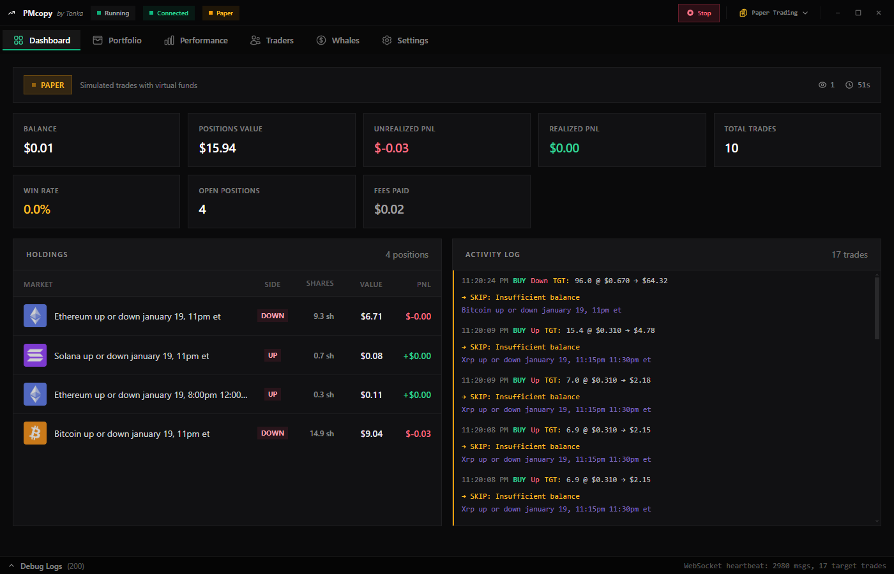
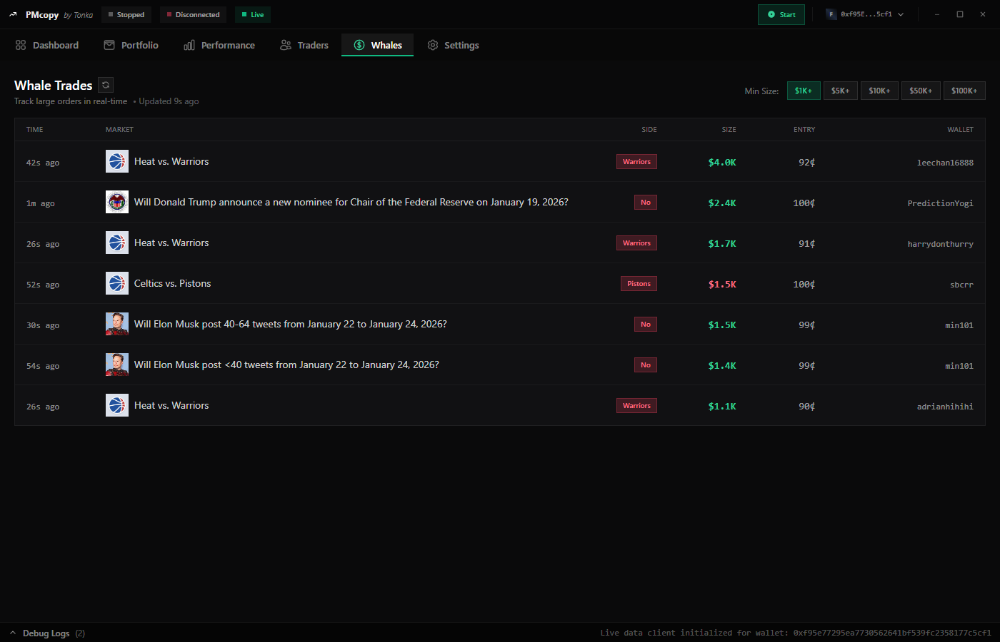
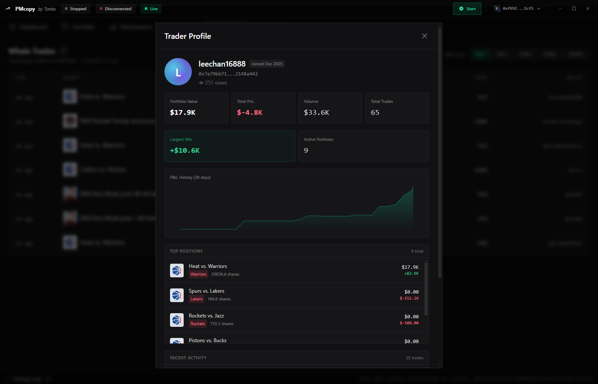
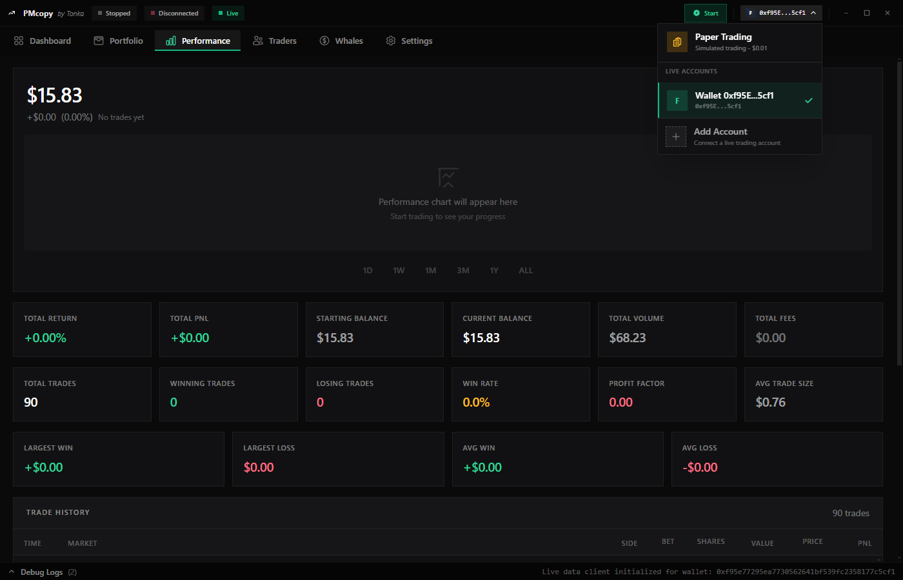
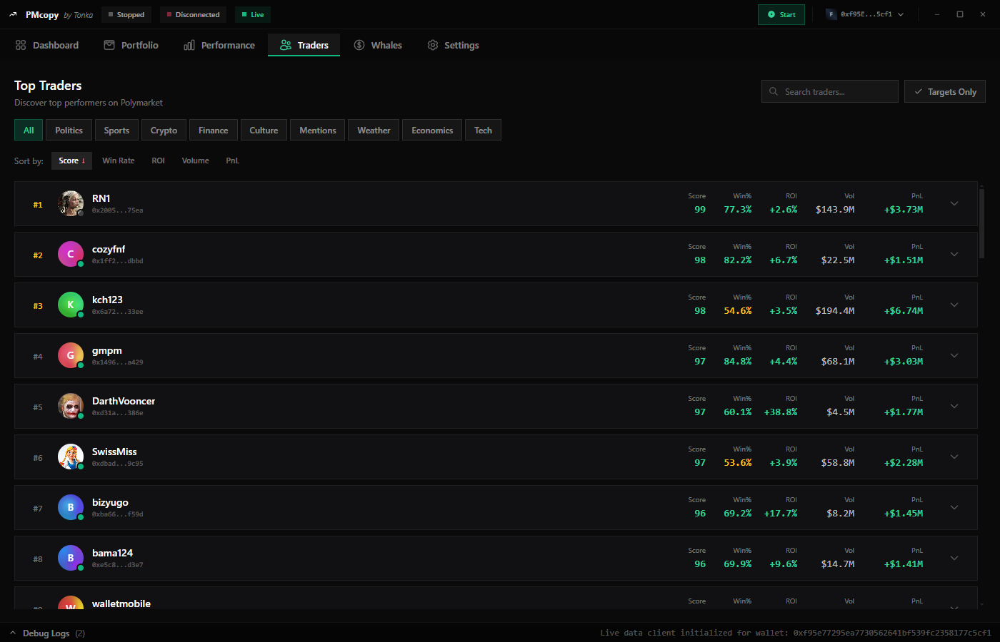
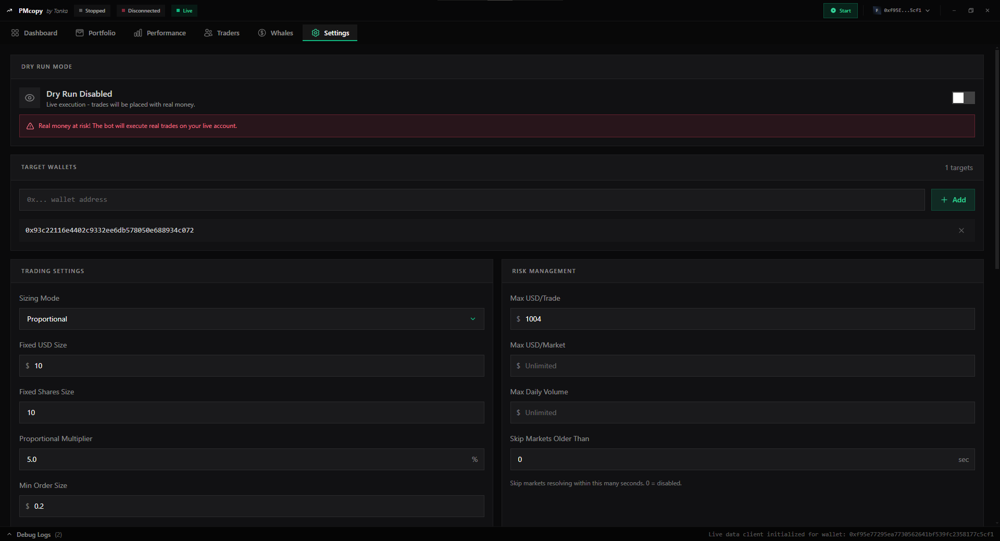

# Polymarket Copy Trading Bot 🚀

A professional-grade copy trading platform for Polymarket prediction markets. Monitor whale traders in real-time and automatically copy their trades with advanced risk management features.



JOIN DISCORD: https://discord.gg/ZX5nJzWdVG

---

## ⚠️ IMPORTANT DISCLAIMER

**TRADING PREDICTION MARKETS INVOLVES SIGNIFICANT FINANCIAL RISK.**

- This software is provided "as-is" without any warranties
- You may lose all of your invested capital
- Past performance does not guarantee future results
- Only trade with money you can afford to lose
- Always start with paper trading and small amounts
- Keep your API credentials secure and never share them
- Monitor the bot regularly and never leave it unattended
- Be aware of tax implications in your jurisdiction

**USE AT YOUR OWN RISK.**

---

## 📚 Full Documentation

For detailed instructions, please visit the [Documentation Folder](./docs/):

- **[Installation Guide](./docs/installation.md)**: Step-by-step setup instructions.
- **[User Manual](./docs/user-guide.md)**: How to use the Dashboard, Whales tab, and Settings.
- **[Configuration](./docs/configuration.md)**: Advanced configuration and environment variables.
- **[Paper Trading](./docs/paper-trading.md)**: Learn how to test without real money.
- **[Troubleshooting](./docs/troubleshooting.md)**: Solutions to common issues.
- **[Architecture](./docs/architecture.md)**: For developers.

---

## Features

### 🎯 Core Copy Trading

- **Real-time Trade Detection**: Monitor whale wallets and detect large orders within milliseconds
- **Automated Trade Execution**: Automatically copy trades with configurable size and slippage settings
- **Multiple Sizing Modes**:
  - Fixed USD amount per trade
  - Fixed shares/number of shares
  - Proportional sizing (copy a percentage of the whale's position)
- **Smart Position Management**: Track open positions and automatically handle exits

### 👁️ Advanced Whale Monitoring

- **Whale Trades Dashboard**: Real-time stream of large orders with market context
- **Whale Profile Analytics**: Deep dive into individual trader stats including:
  - Total P&L and win/loss statistics
  - Trade history and performance metrics
  - Portfolio composition and current positions
  - Historical P&L charts with multiple timeframes
- **Filter by Trade Size**: Configurable minimum trade size to focus on meaningful whale activity
- **Price Impact Analysis**: See entry prices and market context for each trade

### 💰 Portfolio & Risk Management

- **Multi-Account Support**: Manage multiple trading accounts simultaneously
- **Paper Trading**: Test strategies with simulated trades before risking real capital
  - Configurable starting balance
  - Realistic fee simulation
  - Full position tracking
- **Stop Loss & Take Profit**: Automatic exit rules with customizable thresholds
- **Risk Controls**:
  - Maximum position size limits
  - Daily loss limits
  - Exposure tracking across positions
- **Live Balance Monitoring**: Real-time portfolio value and P&L tracking

### 📊 Analytics & Performance

- **Performance Dashboard**: Comprehensive stats including win rate, profit factor, largest wins/losses
- **Trade History**: Searchable, filterable trade logs with detailed execution info
- **P&L Visualization**: Charts showing portfolio performance over time
- **Holdings Dashboard**: Current open positions with real-time valuations

### 🛠️ User Interface

- **Desktop Application**: Modern Electron + React desktop app with real-time updates
- **CLI Interface**: Command-line tool for headless trading and automation
- **Responsive Design**: Mobile-friendly responsive UI with Tailwind CSS
- **Dark Theme**: Professional dark color scheme
- **Live Data Sync**: WebSocket-based real-time data

### ⚙️ Configuration & Customization

- **Environment-Based Config**: Manage settings via .env file
- **Strategy Customization**: Define custom trading rules and filters
- **Account Management**: Secure handling of multiple exchange accounts
- **Persistence**: All settings and state automatically saved

---

## Project Structure

```
polymarket-trading-bot/
├── src/                          # CLI & Backend Logic
│   ├── cli.ts                    # Command-line entry point
│   ├── commands/                 # CLI command implementations
│   │   ├── run.ts               # Run the copy trading bot
│   │   ├── paper.ts             # Paper trading commands
│   │   ├── config.ts            # Configuration management
│   │   ├── status.ts            # Check bot status
│   │   └── ...
│   ├── config/                   # Configuration handling
│   ├── copier/                   # Core copy trading logic
│   │   ├── executor.ts          # Trade execution engine
│   │   ├── watcher.ts           # Whale monitoring
│   │   ├── paperTrading.ts      # Paper trading simulator
│   │   ├── state.ts             # Position/trade state management
│   │   └── risk.ts              # Risk management rules
│   ├── polymarket/               # Polymarket API integration
│   │   ├── clobClient.ts        # CLOB API wrapper
│   │   ├── dataApi.ts           # Data API client
│   │   ├── gammaApi.ts          # Gamma API client
│   │   └── tokenResolver.ts     # Token/contract resolution
│   ├── data/                     # Data persistence
│   │   ├── fileProvider.ts      # File-based storage
│   │   ├── redisProvider.ts     # Redis storage (optional)
│   │   └── persistence.ts       # Persistence abstraction
│   ├── utils/                    # Utility functions
│   │   ├── logger.ts            # Logging utilities
│   │   ├── dashboard.ts         # Terminal UI
│   │   ├── http.ts              # HTTP client
│   │   └── ...
│   └── types/                    # TypeScript type definitions
│
├── client/                       # Desktop Application (Electron + Next.js)
│   ├── main/                     # Main process (Electron)
│   │   ├── background.ts        # Electron app entry & IPC handlers
│   │   ├── botService.ts        # Bot service management
│   │   ├── liveDataClient.ts    # Real-time data WebSocket
│   │   ├── helpers/             # Helper utilities
│   │   └── preload.ts           # Preload script for IPC
│   │
│   ├── renderer/                 # Renderer process (Next.js + React)
│   │   ├── pages/               # Next.js pages
│   │   │   ├── _app.tsx         # Root app component
│   │   │   ├── home.tsx         # Dashboard page
│   │   │   └── next.tsx         # Portfolio/Traders pages
│   │   ├── components/          # React components
│   │   │   ├── Tabs.tsx         # Main UI with all tabs
│   │   │   └── NavBar.tsx       # Navigation bar
│   │   ├── styles/              # CSS & Tailwind config
│   │   ├── public/              # Static assets
│   │   ├── types/               # TypeScript definitions
│   │   ├── next.config.js       # Next.js configuration
│   │   └── tailwind.config.js   # Tailwind CSS config
│   │
│   ├── app/                      # Built Electron app (generated)
│   ├── dist/                     # Distribution build (generated)
│   ├── resources/                # App resources (icons, etc)
│   └── package.json              # Client dependencies
│
├── data/                         # Data directory (persistent)
│   ├── config.json              # Saved configuration
│   ├── accounts.json            # Account credentials
│   ├── state.json               # Trading state
│   ├── paper-state.json         # Paper trading state
│   ├── live-balance.json        # Balance snapshots
│   ├── token-cache.json         # Cached token data
│   └── logs/                    # Log files
│
├── logs/                        # Application logs
├── .env.example                 # Example environment configuration
├── .gitignore                   # Git ignore rules
├── package.json                 # Root dependencies
├── tsconfig.json                # TypeScript configuration
├── setup.sh / setup.bat         # Setup scripts
├── dev.sh / dev.bat             # Development scripts
└── README.md                    # This file
```

---

## Quick Start

### Prerequisites

- **Node.js** 18.0.0 or higher ([download](https://nodejs.org))
- **npm** 8.0.0 or higher (comes with Node.js)
- **Polymarket Account** with API credentials
- **Optional: Redis** for distributed state management

### Step 1: Clone Repository

```bash
git clone https://github.com/yourusername/polymarket-trading-bot.git
cd polymarket-trading-bot
```

### Step 2: Run Setup Script

**On Windows:**

```bash
setup.bat
```

**On macOS/Linux:**

```bash
bash setup.sh
```

This will:

1. ✓ Check Node.js installation
2. ✓ Install all dependencies
3. ✓ Build TypeScript and Electron apps
4. ✓ Create initial data directories

### Step 3: Configure Environment

```bash
cp .env.example .env
# Edit .env with your Polymarket API credentials
```

### Step 4: Start the App

**Desktop Application:**

```bash
dev.bat    # Windows
# or
bash dev.sh  # macOS/Linux
# Choose option 1 for Desktop App
```

**CLI Bot:**

```bash
bash dev.sh  # Choose option 2
# or
npm run dev
```

---

## Configuration

### Environment Variables (.env)

#### Polymarket API Credentials

```env
# Your Polymarket CLOB API credentials
POLY_API_KEY=your_api_key
POLY_API_SECRET=your_api_secret
POLY_PASSPHRASE=your_passphrase

# Your trading wallet address
POLY_FUNDER_ADDRESS=0x...

# Signature type: 0=EOA, 1=Magic, 2=Safe
POLY_SIGNATURE_TYPE=1
```

#### Trading Strategy

```env
# Polling interval (ms)
POLL_INTERVAL_MS=500

# Sizing mode: fixed_usd | fixed_shares | proportional
SIZING_MODE=proportional

# Default USD size per trade
DEFAULT_USD_SIZE=10

# Proportional multiplier (0-1)
PROPORTIONAL_MULTIPLIER=0.25

# Minimum order size in USD
MIN_ORDER_SIZE=0.1

# Slippage tolerance
SLIPPAGE_TOLERANCE=0.01
```

#### Risk Management

```env
# Maximum position size in USD
MAX_POSITION_SIZE=1000

# Daily loss limit in USD
DAILY_LOSS_LIMIT=500

# Profit taking threshold
PROFIT_TARGET_PCT=10

# Stop loss threshold
STOP_LOSS_PCT=5
```

#### Paper Trading

```env
# Enable paper trading
PAPER_TRADING=false

# Starting virtual balance
PAPER_STARTING_BALANCE=10000

# Simulated fee rate
PAPER_FEE_RATE=0.001
```

---

## Usage

### Desktop Application

Start and use all features from the UI:

**[Insert dashboard screenshot here]**

**Tabs:**

- 📊 **Dashboard**: Portfolio overview and balance
- 💰 **Portfolio**: Open and closed positions
- 👥 **Traders**: Monitor trader activity
- 🐋 **Whales**: Real-time whale trades with filtering
- 📈 **Performance**: Trade history and analytics
- ⚙️ **Settings**: Configure accounts and strategies

### CLI Interface

```bash
# Run the bot
npm run dev -- run [options]

# Manage accounts
npm run dev -- config set|get|list

# Check status
npm run dev -- status

# View statistics
npm run dev -- stats

# Paper trading
npm run dev -- paper reset|stats|config
```

---

## Desktop App Screenshots

### Dashboard


### Whale Trades



### Whale Profile



### Performance



### Traders



### Settings



---

## Advanced Features

### Paper Trading

Test strategies without real capital:

1. Enable in Settings and set starting balance
2. Run normally - all trades execute in simulation
3. Review metrics in Performance tab
4. Reset to start fresh

Paper trading automatically:

- Simulates fills at market prices
- Tracks P&L with realistic fees
- Settles resolved positions at $1/$0
- Maintains full trade history

### Risk Management

Built-in safety features:

- **Position Size Limits**: Cap individual positions
- **Daily Loss Limits**: Stop trading after threshold
- **Stop Loss Orders**: Auto-exit at loss percentage
- **Take Profit**: Auto-exit at profit target
- **Exposure Monitoring**: Track total market exposure

### Multi-Account Support

Trade from multiple accounts simultaneously:

1. Add accounts in Settings → Accounts
2. Configure per-account settings
3. Monitor all from unified dashboard
4. Enable/disable accounts individually

### Whale Filtering

Filter whale trades by:

- **Minimum size**: Focus on meaningful activity
- **Market category**: Specific prediction markets
- **Trader stats**: Filter by performance
- **Time-based**: Peak trading hours only

---

## Performance Optimization

For high-frequency trading:

1. **Reduce polling interval**: Faster detection (watch API limits)
2. **Use Redis**: Distributed state for multiple instances
3. **WebSocket mode**: Real-time updates instead of polling
4. **Account parallelization**: Trade from multiple accounts

---

## Troubleshooting

### Common Issues

**"API credentials not valid"**

- Verify credentials in .env
- Check permissions on API key
- Ensure environment variables are loaded

**"Can't connect to Polymarket"**

- Check internet connection
- Verify API endpoints are accessible
- Check firewall/proxy settings

**"Insufficient balance"**

- Ensure account has enough USDC
- Check position sizing settings
- Review pending orders

**"High latency / slow trades"**

- Reduce POLL_INTERVAL_MS
- Check internet speed
- Close bandwidth-heavy applications
- Consider WebSocket mode

### Debug Mode

Enable detailed logging:

```bash
export LOG_LEVEL=debug
npm run dev
```

Check logs in `data/logs/pmcopy.log`

---

## Development

### Setup Development Environment

```bash
# Install dependencies
npm install
cd client && npm install && cd ..

# Start in development mode
npm run dev

# Build for production
npm run build
```

### Technology Stack

- **Backend**: TypeScript, Node.js
- **Desktop UI**: Electron, Next.js, React 18
- **Styling**: Tailwind CSS with Container Queries
- **State**: React Hooks, Electron Store
- **Data**: JSON files, optional Redis
- **APIs**: Polymarket CLOB, Data API, Real-time client
- **Charts**: Lightweight Charts

### Code Organization

- **CLI Commands**: `src/commands/`
- **Core Logic**: `src/copier/`
- **API Integration**: `src/polymarket/`
- **UI Components**: `client/renderer/components/`
- **Electron IPC**: `client/main/background.ts`

---

## Security Best Practices

1. **Never share your private key or API credentials**
2. **Use a dedicated wallet** with limited funds
3. **Start with paper trading** before live trading
4. **Set conservative limits** initially
5. **Monitor regularly** and never leave unattended
6. **Keep .env secure** (it's gitignored by default)
7. **Review all transactions** before confirming

---

## Contributing

Contributions are welcome! Please:

1. Fork the repository
2. Create a feature branch (`git checkout -b feature/amazing-feature`)
3. Commit your changes (`git commit -m 'Add amazing feature'`)
4. Push to the branch (`git push origin feature/amazing-feature`)
5. Open a Pull Request

Ensure:

- Code is properly typed with TypeScript
- Changes are tested
- No API keys are committed
- Commit messages are clear

---

## Support & Contact

- 💬 Discord: [Join our Discord](https://discord.gg/ZX5nJzWdVG)
- 🐛 Issues: [GitHub Issues](https://github.com/TONKAFREAK/polymarket-trading-bot/issues)
- 📚 Docs: [Full Documentation](./docs/)

---

## Changelog

### v1.0.0

- ✅ Initial release
- ✅ Desktop application with real-time monitoring
- ✅ Whale trades detection and filtering
- ✅ Paper trading with full position tracking
- ✅ Multi-account support
- ✅ Advanced analytics and performance tracking
- ✅ Risk management tools
- ✅ CLI interface for headless trading

---

## License

MIT License - see [LICENSE](LICENSE) file for details.

---

Made with ❤️ for the Polymarket community
